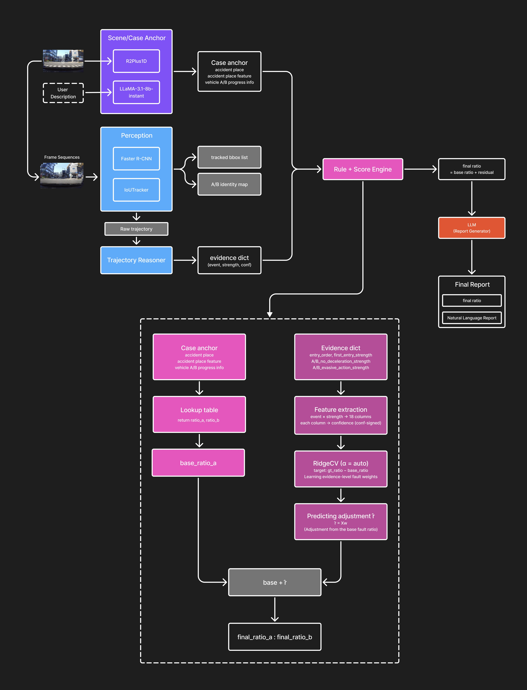

# 교통사고 과실비율 자동 분석 시스템

블랙박스 사고 영상과 사용자 진술을 입력받아 **사고 유형 / 장소 / 차량 진행 정보를 자동 분류**하고, **객체 탐지·추적 기반의 evidence**와 **규칙·잔차 모델**을 결합해 최종 과실비율과 한국어 자연어 보고서를 생성하는 end-to-end 시스템입니다.

## 전체 구조



| 단계 | 모듈 | 모델 / 기법 |
|---|---|---|
| Scene / Case Anchor | 영상 분류 | R2Plus1D (사고 장소 특징, A/B 진행 정보) |
| Statement Parsing | 위반사항 추출 | LLaMA-3.1-8B-Instant (Groq) |
| Perception | 객체 탐지 / 추적 | Faster R-CNN + IoU Tracker |
| Trajectory Reasoning | evidence 산출 | bbox track → entry order / no-deceleration / evasive action |
| Rule + Score Engine | 기준 비율 + 보정 | Lookup table + RidgeCV (잔차 학습) |
| Report Generation | 자연어 보고서 | LLaMA-3.1-8B-Instant (Groq) |

## 프로젝트 구조

```text
2026-1-semester-CV-project/
├── app.py                          # Gradio 웹 데모
├── train_video_classifier.py       # R2Plus1D 학습 스크립트
├── detect/
│   ├── train_detector.py           # Faster R-CNN 학습 스크립트
│   └── detection_outputs/          # 학습된 detector 가중치
├── classification/
│   └── video_classification_outputs/  # 학습된 classifier 가중치
├── scripts/
│   ├── train_adjustment.py         # 잔차 모델 학습 (RidgeCV)
│   ├── run_case.py                 # CLI 추론 (영상 1건)
│   ├── build_adjustment_csv.py
│   ├── build_adjustment_csv_from_labels.py
│   └── prepare_input.py
├── src/accident_liability/
│   ├── scene/                      # 영상 분류기 + 클래스 매핑
│   ├── perception/                 # detector + IoU tracker
│   ├── trajectory/                 # bbox → evidence 추출
│   ├── rules/                      # base ratio lookup + adjustment
│   ├── llm/                        # Groq violation parser
│   ├── report/                     # 보고서 generator
│   ├── pipeline/                   # end-to-end orchestrator
│   └── schemas.py                  # 공용 dataclass
├── data/
│   ├── lookup/                     # base_ratio_table.csv, class_maps/
│   └── adjustment_input.csv        # 잔차 학습용 CSV
├── outputs/adjustment/             # 학습된 adjustment model
└── requirements.txt
```

## 설치

```bash
git clone https://github.com/sdfjslfjafkdl/2026-1-semester-CV-project.git
cd 2026-1-semester-CV-project

pip install -r requirements.txt
pip install python-dotenv          # .env 로드용
```

ffmpeg 시스템 패키지도 필요합니다:

```bash
# macOS
brew install ffmpeg

# Ubuntu / RunPod
apt-get update && apt-get install -y ffmpeg
```

## Groq API Key 설정

자연어 보고서 생성에는 [Groq API key](https://console.groq.com)가 필요합니다 (무료).

```bash
echo "GROQ_API_KEY=your_api_key" > .env
```

## 앱 실행

```bash
# CPU
python app.py

# GPU (RunPod 등)
python app.py --device cuda --share
```

`--share` 옵션은 외부에서 접속 가능한 `*.gradio.live` 공개 URL을 생성합니다. 로컬은 `http://localhost:7860` 으로 접속.

## 모델 학습

### 1) 영상 분류기 (Scene / Case Anchor)

R2Plus1D 기반으로 `accident_place_feature`, `vehicle_a_progress_info`, `vehicle_b_progress_info` 세 가지 레이블을 multi-head로 학습합니다.

```bash
python train_video_classifier.py \
  --train_json classification/video_data/processed/train.json \
  --val_json classification/video_data/processed/val.json \
  --output_dir classification/video_classification_outputs \
  --epochs 100 \
  --batch_size 2 \
  --frame_size 224 \
  --lr 1e-4 \
  --device cuda:0
```

### 2) 객체 탐지기 (Perception)

차량 / 자전거 / 이륜차 등을 탐지하는 Faster R-CNN을 COCO 형식 어노테이션으로 학습합니다. 경로는 `detect/train_detector.py` 내부에 하드코딩되어 있습니다 (`detect/processed/{train,val}_coco.json`).

```bash
python detect/train_detector.py
```

학습된 가중치는 `detect/detection_outputs/checkpoints/faster_rcnn_baseline/best.pth` 로 저장됩니다.

### 3) 가감 보정 모델 (Adjustment / Residual)

evidence 특성과 (실측 과실비율 − 기준 과실비율)을 RidgeCV로 회귀합니다.

```bash
python scripts/train_adjustment.py \
  --input_csv data/adjustment_input.csv \
  --output_dir outputs/adjustment
```

산출물: `outputs/adjustment/adjustment_model.joblib`, `learned_adjustment_table.csv`

## 추론 (CLI)

GUI 없이 영상 1건만 추론할 때 사용합니다.

```bash
python scripts/run_case.py \
  --video_path path/to/accident.mp4 \
  --statement "상대 차량이 신호를 무시하고 진입했습니다." \
  --accident_place "사거리교차로(신호등 있음)" \
  --base_ratio_csv data/lookup/base_ratio_table.csv \
  --adjustment_model outputs/adjustment/adjustment_model.joblib \
  --classifier_weights classification/video_classification_outputs/best.pth \
  --device cuda \
  --use_llm
```

옵션 요약:
- `--classifier_weights` 지정 시 영상에서 anchor (사고 장소 특징, A/B 진행 정보)를 자동 예측
- 미지정 시 `--accident_place_feature`, `--vehicle_a_progress_info`, `--vehicle_b_progress_info` 를 수동 입력해야 함
- `--use_llm` 플래그로 진술을 LLM으로 파싱하여 위반사항을 추출 (`GROQ_API_KEY` 필요)
